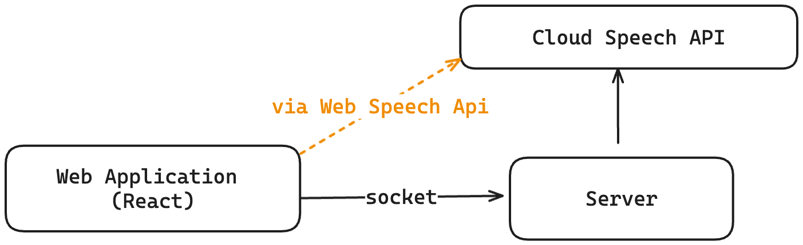

# Description

This project demonstrates the use of the conversational tools in Google Cloud, by building a voice-powered web game.

The game has three functions:

- Shows a picture question
- Consumes and processes a voice-based answer
- Checks if the answer is correct and provides feedback

# System Diagram

## React application

## `useSpeech`

## Service Worker

# Speech Apis

## Web Speech Apis

## Cloud Speech Apis

### Api details

### Audio Streaming with sockets

# Talks & Presentation

- [Slides](https://docs.google.com/presentation/d/e/2PACX-1vSCCaXTQ3krJxLd9Y5mtGgNcGJ-BgGen7vvCIbYSKJeizY6bcxrbr5I6QXZ4Qd8gU13dBGzHPzW0MPR/pub?start=false&loop=false&delayms=3000)
- [Talk](https://youtu.be/hr8NPNJjIn0)

# References

- https://developer.mozilla.org/en-US/docs/Web/API/Web_Speech_API
